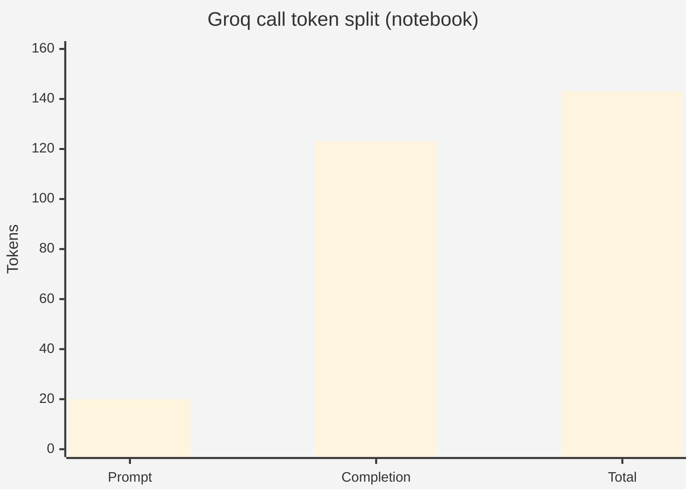
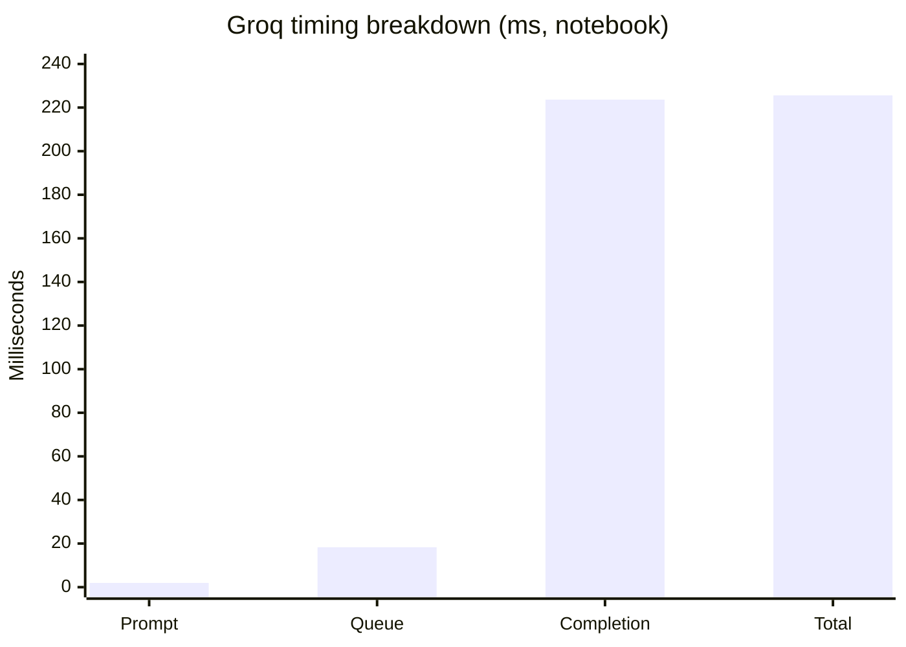
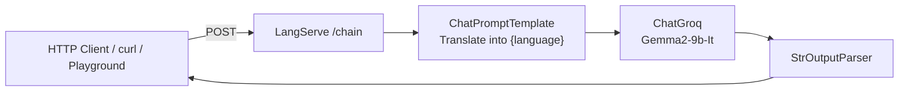
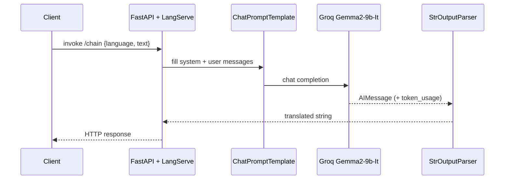
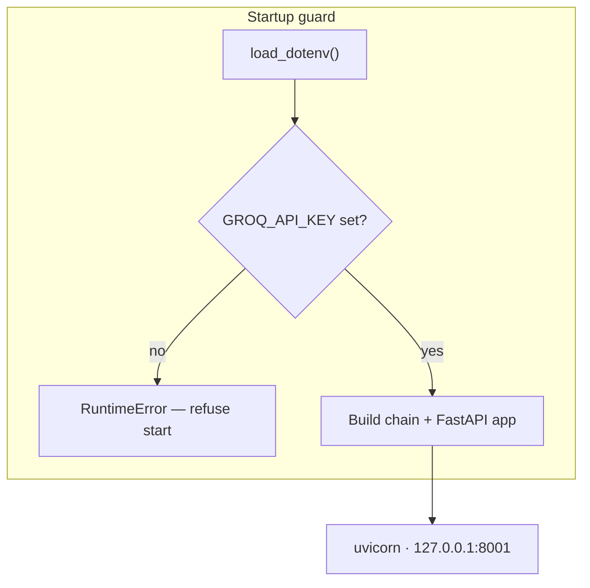
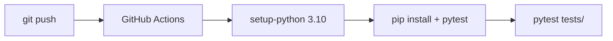

# LangServe Translator API

### Production-style **LLM translation microservice** — FastAPI + LangServe + LangChain LCEL over **Groq Gemma2-9b-It**

<p align="center">
  
  
  
  
</p>

<p align="center">
  
  
  <a href="tests/test_langserve_translator_api.py"></a>
  <a href=".github/workflows/ci.yml"></a>
</p>

---

## Overview

A minimal, deployable **HTTP translation API** that wraps an LLM prompt chain:

```text
ChatPromptTemplate  →  ChatGroq(Gemma2-9b-It)  →  StrOutputParser
```

Exposed with **`langserve.add_routes(..., path="/chain")`** on **FastAPI**, run via **Uvicorn** on **`127.0.0.1:8001`**. Companion notebook `simplellm.ipynb` prototypes the same LCEL flow (English → Kannada) and records live Groq usage metadata.

Signals for **Applied AI / Backend / LLM platform** portfolios: prompt templates, LCEL composition, LangServe hosting, secrets via `.env`, and CI-backed pytest.

> Numbers below are taken from **committed notebook outputs and source**. No BLEU/accuracy scores were invented — none are published as formal eval harness results in-repo.

---

## Results (committed artifacts)

### Live Groq inference metadata (`simplellm.ipynb`)

English → Kannada probe (`"Hello How are you"`) against **`Gemma2-9b-It`**:

| Metric | Value |
|--------|--------|
| Model | **Gemma2-9b-It** |
| Finish reason | **stop** |
| Prompt tokens | **20** |
| Completion tokens | **123** |
| Total tokens | **143** |
| Prompt time | **0.001938706 s** (~1.94 ms) |
| Queue time | **0.018324364 s** (~18.3 ms) |
| Completion time | **0.223636364 s** (~224 ms) |
| Total time | **0.22557507 s** (~226 ms) |
| Usage metadata | input **20** · output **123** · total **143** |





Sample translated content (notebook stdout, preserved):

```text
Hello  → ನಮಸ್ತೆ (Namaste)
How are you? → ನೀವೇ ಹೇಗಿದ್ದೀರಿ? (Nīvē hēge iddīri?)
```

### Service / repo facts

| Fact | Value | Source |
|------|--------|--------|
| Default bind | **`127.0.0.1:8001`** | `server.py` |
| Mount path | **`/chain`** | `langserve.add_routes` |
| Chain stages | **3** (prompt \| model \| parser) | `server.py` |
| Tracked files | **6** | git tree |
| pytest cases | **9** | `tests/` |
| Languages (bytes) | Jupyter **7,213** · Python **3,059** | GitHub API |
| CI Python | **3.10** | GitHub Actions |
| Model ID in code | **`Gemma2-9b-It`** | `server.py` + notebook |


### Test fixture numbers (unchanged)

| Item | Value |
|------|--------|
| Example language set size | **8** (`en es fr de zh ja ar hi`) |
| Long-text stress | **500** words (`"word " * 500`) |
| Batch size example | **3** strings |
| Mock response confidence field | **0.95** (structure test) |

---

## Architecture







---

## How the chain works

```python
prompt_template = ChatPromptTemplate.from_messages([
    ("system", "Translate the following into {language}:"),
    ("user", "{text}"),
])
chain = prompt_template | ChatGroq(model="Gemma2-9b-It", ...) | StrOutputParser()
add_routes(app, chain, path="/chain")
```

| Stage | Role |
|-------|------|
| **Prompt** | Parameterized system instruction + user text |
| **Model** | Groq-hosted **Gemma2-9b-It** |
| **Parser** | `AIMessage` → plain `str` |
| **Serving** | LangServe routes on FastAPI `/chain` |

Notebook progression mirrors production: raw `invoke` → `StrOutputParser` → LCEL `model|parser` → reusable `ChatPromptTemplate`.

---

## Repository layout

```text
LangServe-Translator-API/
├── server.py                              # FastAPI + LangServe translator
├── simplellm.ipynb                        # LCEL / Groq experiment + timings
├── requirements.txt                       # fastapi · langchain* · langserve · groq
├── tests/test_langserve_translator_api.py # 9 pytest cases
└── .github/workflows/ci.yml               # Python 3.10 · flake8 · pytest
```

---

## Tech stack & keywords

| Layer | Technology |
|-------|------------|
| API | **FastAPI**, **LangServe**, **Uvicorn** |
| Orchestration | **LangChain** / **langchain-core** LCEL |
| LLM | **langchain-groq** · **Gemma2-9b-It** |
| Config | **python-dotenv** · `GROQ_API_KEY` |
| Quality | **pytest**, **GitHub Actions**, flake8 |
| Exploration | Jupyter (`simplellm.ipynb`) |

**Keyword surface:** Python · FastAPI · LangServe · LangChain · LCEL · Groq · Gemma2 · LLM API · machine translation · prompt engineering · REST · uvicorn · dotenv · pytest · CI/CD · Applied AI · backend engineering

---

## Quickstart

```bash
git clone https://github.com/ArchanaChetan07/LangServe-Translator-API.git
cd LangServe-Translator-API

python -m venv .venv
# Windows: .\.venv\Scripts\Activate.ps1
source .venv/bin/activate

pip install -r requirements.txt
echo GROQ_API_KEY=your_key_here > .env

python server.py
# → http://127.0.0.1:8001/chain/...   (LangServe playground / invoke routes)

pytest tests/ -v
```

Explore the notebook (same model + prompt pattern):

```bash
jupyter notebook simplellm.ipynb
```

---

## Testing & CI/CD

| Suite | Coverage |
|-------|----------|
| `TestTranslatorAPI` | language set · empty input · string output · lang codes · 500-word text · unicode |
| `TestAPIEndpoints` | request/response shape · batch length parity |
| Actions | Ubuntu · Python **3.10** · flake8 · `pytest tests/` |



---

## Design notes & roadmap

- Startup **fails closed** if `GROQ_API_KEY` is missing — good ops hygiene for secret-backed LLM services.  
- Pin dependency versions in `requirements.txt` for reproducible deploys.  
- Add Dockerfile + sample `curl` / OpenAPI snippets for playground invoke payloads.  
- Optional: formal BLEU/COMET eval harness (not present today — do not claim until committed).

---

<p align="center">
  <b>LangServe Translator API</b><br/>
  <a href="https://github.com/ArchanaChetan07/LangServe-Translator-API">github.com/ArchanaChetan07/LangServe-Translator-API</a>
</p>
