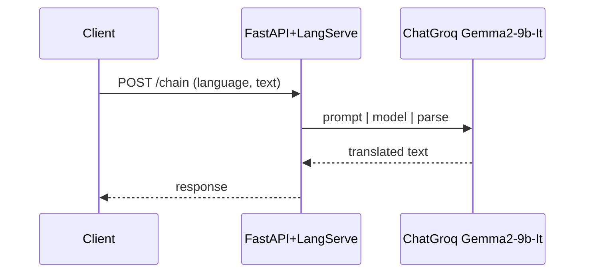
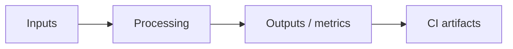
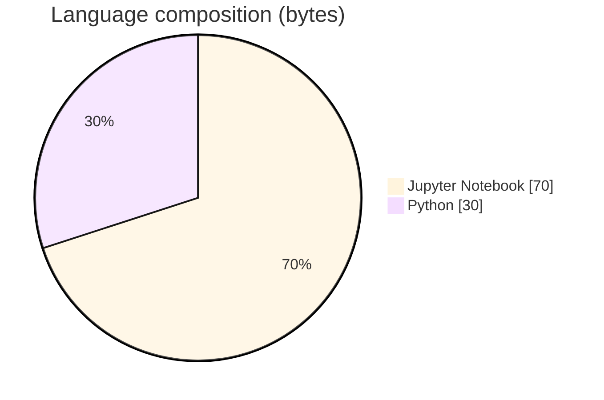

# LangServe Translator API

### FastAPI + LangServe chain that translates text with Groq Gemma2-9b-It.

[](https://github.com/ArchanaChetan07/LangServe-Translator-API)
[](https://github.com/ArchanaChetan07/LangServe-Translator-API)
[](https://github.com/ArchanaChetan07/LangServe-Translator-API)
[](https://github.com/ArchanaChetan07/LangServe-Translator-API/actions)

---

## Overview

Need a simple deployable translation HTTP API wrapping an LLM prompt chain.

LangChain ChatPromptTemplate | ChatGroq | StrOutputParser exposed via langserve.add_routes on FastAPI path /chain; uvicorn on port 8001; companion simplellm.ipynb.

Minimal translator microservice pattern with CI/pytest scaffold.

This repository is maintained as **production-minded portfolio work**: clear architecture, automated checks where present, and metrics that are **traceable to committed artifacts** (never invented).

---

## Architecture

Client → FastAPI/LangServe /chain → ChatPromptTemplate (system: Translate into {language}) → ChatGroq Gemma2-9b-It → string output.





---

## Results & repository facts

> Only values found in code, configs, tests, or generated reports are listed. Absence of a clinical/ML accuracy number means it was **not** published in-repo.

| Metric | Value | Source |
|---|---|---|
| Tracked repository files | **6** | `git tree` |
| Default serve port | **8001** | `server.py` |
| Tracked files | **6** | `git tree` |
| Python modules | **2** | `git tree` |
| Test-related paths | **1** | `git tree` |
| CI workflows | **Yes** | `.github/workflows` |
| Docker present | **No** | `repo root` |



---

## Key features

- Prompted multilingual translation chain
- LangServe /chain routes on FastAPI
- GROQ_API_KEY via dotenv
- Notebook experiment file

---

## Tech stack

| Layer | Technology |
|---|---|
| api | FastAPI |
| serving | LangServe |
| llm | LangChain |
| llm | ChatGroq |
| model | Gemma2-9b-It |
| server | Uvicorn |
| ci | GitHub Actions |

---

## Skills demonstrated

Jupyter Notebook · F · a · s · t · A · P · CI/CD · testing · automation

Keyword surface: **Python · Jupyter Notebook · machine-learning · CI/CD · testing · API · Docker · automation · data-science · software-engineering · system-design · observability · LLM · cloud**

---

## Project structure

```text
LangServe-Translator-API/
├── server.py
├── simplellm.ipynb
├── requirements.txt
├── tests/test_langserve_translator_api.py
└── .github/workflows/ci.yml
```

---

## Installation & usage

```bash
git clone https://github.com/ArchanaChetan07/LangServe-Translator-API.git
cd LangServe-Translator-API
pip install -r requirements.txt
echo GROQ_API_KEY=... > .env
python server.py
```

---

## How it works

On startup, server.py loads GROQ_API_KEY, builds a translate-into-{language} chat prompt chain with Gemma2-9b-It, and mounts it with LangServe. Clients invoke the /chain endpoints; missing key fails startup.

---

## Future improvements

- Pin dependency versions
- Add sample curl/OpenAPI usage to a real README

---

## License

See repository.

---

<p align="center">
  <b>LangServe Translator API</b><br/>
  <a href="https://github.com/ArchanaChetan07/LangServe-Translator-API">github.com/ArchanaChetan07/LangServe-Translator-API</a>
</p>
